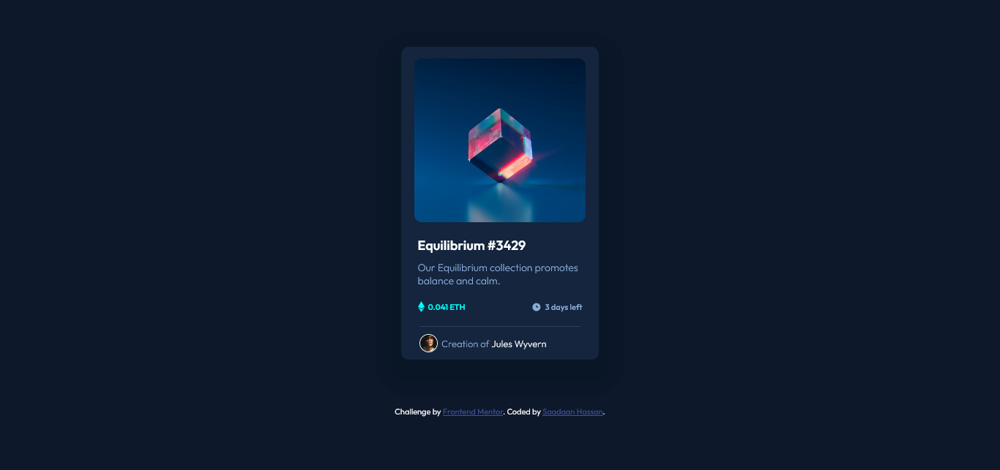

# Frontend Mentor - NFT preview card component solution

This is a solution to the [NFT preview card component challenge on Frontend Mentor](https://www.frontendmentor.io/challenges/nft-preview-card-component-SbdUL_w0U). Frontend Mentor challenges help you improve your coding skills by building realistic projects.

## Table of contents

- [Overview](#overview)
  - [The challenge](#the-challenge)
  - [Screenshot](#screenshot)
  - [Links](#links)
- [My process](#my-process)
  - [Built with](#built-with)
  - [What I learned](#what-i-learned)
  - [Useful resources](#useful-resources)
- [Author](#author)

**Note: Delete this note and update the table of contents based on what sections you keep.**

## Overview

### The challenge

Users should be able to:

- View the optimal layout depending on their device's screen size
- See hover states for interactive elements

### Screenshot




### Links

- Solution URL: [Add solution URL here](https://your-solution-url.com)
- Live Site URL: [Add live site URL here](https://your-live-site-url.com)

## My process

### Built with

- Semantic HTML5 markup
- CSS custom properties
- Flexbox

### What I learned

The project was interesting. It helped me a lot to understand how I can target child elements using different methods. The main thing I learned from this project was the overlaying concept. It was fun to do this project.

```html
<div class="img">
  <div class="img-overlay flex-all-center">
    
  </div>
</div>
```

```css

.img {
  --img-height: 14rem;

  background: url(../images/image-equilibrium.jpg) center center/cover;
  width: calc(var(--width) - (var(--width) / 7.5));
  height: var(--img-height);
  margin-top: 16px;
  border-radius: var(--radius);
  position: relative;
}

.img-overlay {
  border-radius: var(--radius);
  z-index: 1;
  position: absolute;
  width: 100%;
  height: var(--img-height);
  cursor: pointer;
}

.img-overlay img {
  visibility: hidden;
}

.img-overlay:hover {
  background: rgba(0, 255, 247, 0.473);
}

.img-overlay:hover img {
  visibility: visible;
}
```

### Useful resources

- [Stack Overflow](https://stackoverflow.com/questions/18815157/how-to-overlay-image-with-color-in-css) - This helped me for overlaying the background color on the image. I really liked this pattern and will use it going forward.
- [W3 Schools](https://www.w3schools.com/cssref/css_selectors.asp) - This website is the best, and I have referenced it multiple times. This time I understand how to target a child element differently.

## Author

- Frontend Mentor - [@Saadaan Hassan](https://www.frontendmentor.io/profile/Saadaan-Hassan)
